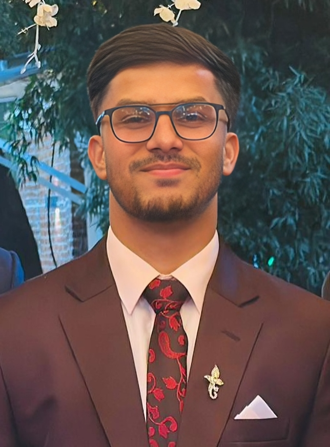

# Hi there, I'm Diwas Neupane 👋

  

  

## 🚀 About Me

I am a **Computer Science graduate** specializing in **Natural Language Processing** and **Model Fine-tuning**, with hands-on experience building **RAG systems**, training open-source LLMs, and developing production-ready Flask-based ML APIs. I am passionate about building practical AI solutions that solve real-world problems.

- 🎓 BSc in Computer Science and Information Technology from Tribhuvan University 
- 🌱 Focused on building scalable AI systems with LangChain, Transformers, and Vector Databases
- 📍 Based in Kathmandu, Nepal
- ⚡ Fun fact: I am a Player of the Tournament winner in Futsal and love trekking!

## 💼 Professional Experience

### Generative AI Intern @ Nnine Solution
*Feb 2025 - May 2025 | Kathmandu, Nepal*

- Developed a **RAG-based chatbot** with domain-specific retrieval capabilities
- Implemented vector embeddings and document chunking strategies using **ChromaDB** and **Ollama**
- Built scalable ML inference endpoints with **Flask** and **LangChain**
- Optimized retrieval performance through query analysis and knowledge-base refinement

## 🛠️ Tech Stack

### Languages

### AI/ML & Data Science

### Tools & Platforms

## 🔥 Featured Projects

---

### 1. 📝 Text Summarization Using LSA
*Technologies: Python, Flask, MySQL, TF-IDF, SVD*

Extractive text summarization system using Latent Semantic Analysis with adjustable summary length.

**Key Features:**
- LSA implementation through TF-IDF and SVD
- Multi-format support (PDF, TXT, DOCX)
- Evaluated on DUC 2007 dataset with ROUGE metrics
- Adjustable summary length control

---

### 2. 🎵 Audio Source Separation
*Technologies: Python, PyTorch, Librosa, Flask*

Wave-U-Net model for end-to-end music source separation into drums, bass, vocals, and other instruments.

**Key Features:**
- Custom Wave-U-Net architecture in PyTorch
- Trained on MUSDB18 dataset
- Real-time audio separation pipeline
- Model checkpointing for resumable training

---

### 3. ⚽ Football Tactical Summary Generator
*Technologies: HuggingFace, Unsloth, Ollama, Python*

Fine-tuned Qwen3-4B model for generating football tactical analysis from match data.

**Key Features:**
- Fine-tuned with Unsloth for optimal performance
- Synthetic data generation using Mistral:7b-instruct
- VLLM compatibility with 4-bit GGUF quantization
- Instruction-based training pipeline

## 🏆 Achievements

- 🥇 **Player of the Tournament 2025** - CSIT Association of Nepal
- 🥈 **Runner-Up: Csitians Goalfest 2024** - CSIT Association of Nepal
- 🥉 **Third Place: Mathematics Presentation Competition 2019** - Newton-Raphson Method
- 🎯 **Event Coordinator** - Futsal Tournament 2024 at Orchid International College

## 📫 Let us Connect!

I am always open to interesting conversations and collaboration opportunities!

  

---

### "Building AI solutions that matter, one model at a time"

